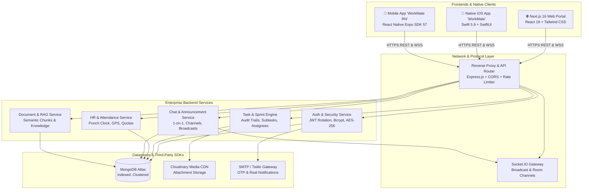
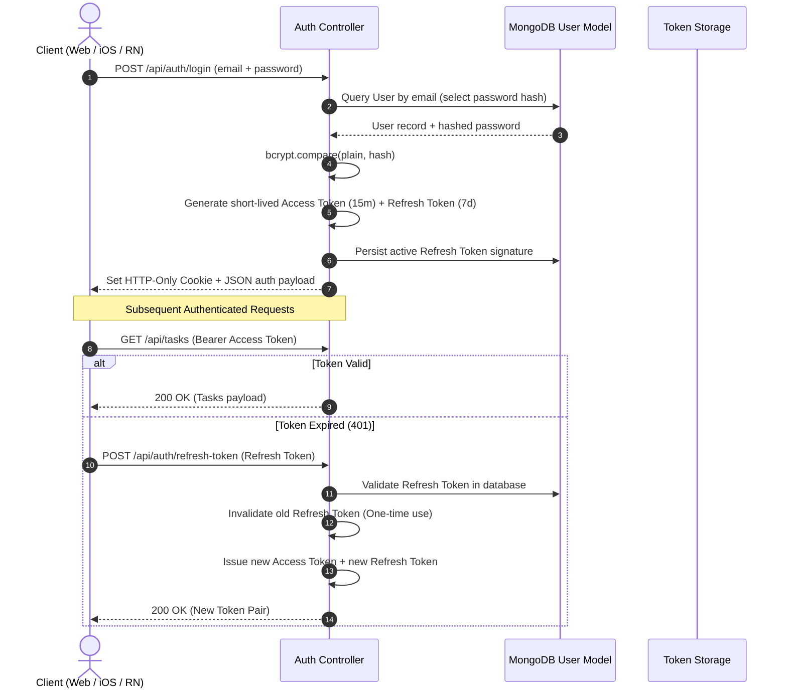
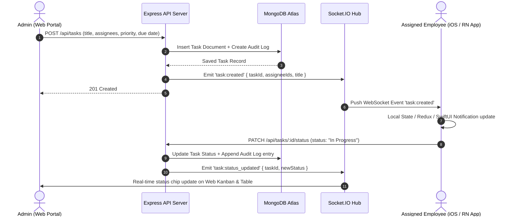
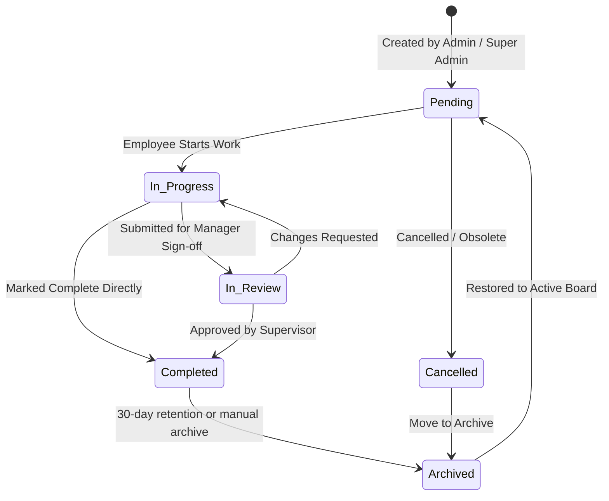
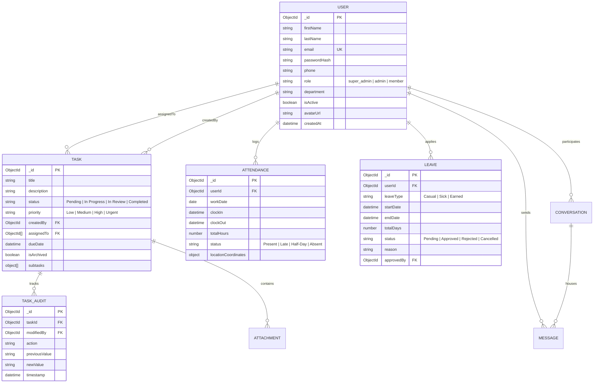

# 🏢 Enterprise Employee Task Management System (ETMS)

<div align="center">

[](https://nodejs.org/)
[](https://nextjs.org/)
[](https://expo.dev/)
[](https://developer.apple.com/swift/)
[](https://www.typescriptlang.org/)
[](https://www.mongodb.com/)
[](https://socket.io/)
[](https://www.cypress.io/)
[](LICENSE)

<br/>

**A multi-platform, cross-device enterprise suite built for modern workforce operations.**  
*Featuring Web (Next.js 16), Native iOS (SwiftUI), Cross-Platform Mobile (React Native Expo), and a high-throughput Node.js microservice architecture.*

[Architecture](#-system-architecture) • [Visual Gallery](#-visual-gallery--screen-showcase) • [Core Features](#-core-capabilities--feature-matrix) • [API Specs](#-rest-api-endpoints) • [Quickstart](#-quick-start--installation)

</div>

---

## 🏗️ System Architecture

The ETMS platform is structured around a centralized high-throughput REST + WebSocket backend communicating concurrently across three distinct frontends:



---

## 📸 Visual Gallery & Screen Showcase

Every screen and interactive view has been captured in high-fidelity full scroll length (`fullPage: true`) across all applications.

### 1. 🌐 Web Portal (Next.js 16 + React 19)

<div align="center">

#### Executive Dashboard & Task Management
<table>
  <tr>
    <td width="50%" align="center">
      <b>Web Executive Dashboard (KPIs, Progress Ring & Donut)</b><br/>
      
    </td>
    <td width="50%" align="center">
      <b>Comprehensive Tasks Directory & Priority Filters</b><br/>
      
    </td>
  </tr>
  <tr>
    <td width="50%" align="center">
      <b>Interactive Task Creation Modal</b><br/>
      
    </td>
    <td width="50%" align="center">
      <b>Attendance Time Clock & Weekly Records</b><br/>
      
    </td>
  </tr>
</table>

#### HR, Leave Management & Directory
<table>
  <tr>
    <td width="50%" align="center">
      <b>Leave Portal (Balance Quotas & Approval Table)</b><br/>
      
    </td>
    <td width="50%" align="center">
      <b>Leave Schedule Calendar View</b><br/>
      
    </td>
  </tr>
  <tr>
    <td width="50%" align="center">
      <b>Apply Leave Modal Sheet</b><br/>
      
    </td>
    <td width="50%" align="center">
      <b>Team Member Directory & Role Cards</b><br/>
      
    </td>
  </tr>
  <tr>
    <td width="50%" align="center">
      <b>Add Team Member / Create User Modal</b><br/>
      
    </td>
    <td width="50%" align="center">
      <b>Real-Time Communication Hub (Direct Chat)</b><br/>
      
    </td>
  </tr>
</table>

#### Planning, Calendar, Compliance & Settings
<table>
  <tr>
    <td width="50%" align="center">
      <b>Calendar Schedule & Deadlines</b><br/>
      
    </td>
    <td width="50%" align="center">
      <b>Calendar Notepad & Sprint Scratchpad</b><br/>
      
    </td>
  </tr>
  <tr>
    <td width="50%" align="center">
      <b>Add Company Holiday Modal</b><br/>
      
    </td>
    <td width="50%" align="center">
      <b>Security Settings & Password Rotation</b><br/>
      
    </td>
  </tr>
  <tr>
    <td width="50%" align="center">
      <b>DPDP Act 2023 Data Export Portal</b><br/>
      
    </td>
    <td width="50%" align="center">
      <b>Archived Tasks & Records Management</b><br/>
      
    </td>
  </tr>
</table>

</div>

---

### 2. 📱 Native iOS App (SwiftUI & Xcode)

Captured directly from iPhone 17 Pro Simulator with native glassmorphism, sparklines, and custom SwiftUI sheets:

<div align="center">

<table>
  <tr>
    <td width="25%" align="center">
      <b>Native Login</b><br/>
      
    </td>
    <td width="25%" align="center">
      <b>iOS Dashboard</b><br/>
      
    </td>
    <td width="25%" align="center">
      <b>Native Tasks</b><br/>
      
    </td>
    <td width="25%" align="center">
      <b>Team Directory</b><br/>
      
    </td>
  </tr>
  <tr>
    <td width="25%" align="center">
      <b>Attendance Clock</b><br/>
      
    </td>
    <td width="25%" align="center">
      <b>Leave Portal</b><br/>
      
    </td>
    <td width="25%" align="center">
      <b>Create Task Sheet</b><br/>
      
    </td>
    <td width="25%" align="center">
      <b>In-App Messages</b><br/>
      
    </td>
  </tr>
</table>

</div>

---

### 3. 📲 Cross-Platform Mobile App (React Native Expo)

Captured across active bottom-navigation tabs with responsive layout, touch feedback, and AI agent integration:

<div align="center">

<table>
  <tr>
    <td width="25%" align="center">
      <b>Auth Selector</b><br/>
      
    </td>
    <td width="25%" align="center">
      <b>Mobile Dashboard</b><br/>
      
    </td>
    <td width="25%" align="center">
      <b>Task Overview</b><br/>
      
    </td>
    <td width="25%" align="center">
      <b>AI Chatbot Assistant</b><br/>
      
    </td>
  </tr>
  <tr>
    <td width="25%" align="center">
      <b>Docs & Knowledge RAG</b><br/>
      
    </td>
    <td width="25%" align="center">
      <b>Mobile Time Clock</b><br/>
      
    </td>
    <td width="25%" align="center">
      <b>Leave Balance & Apply</b><br/>
      
    </td>
    <td width="25%" align="center">
      <b>Profile & Settings</b><br/>
      
    </td>
  </tr>
</table>

</div>

---

## 🔄 Sequence Diagrams & Operational Flows

### 1. Dual-Token Authentication & Refresh Rotation



### 2. Real-Time Task Lifecycle & Synchronization



### 3. Task State Transition State Machine



---

## 🗄️ Database Entity-Relationship Model (ERD)



---

## ⚙️ Role-Based Access Control (RBAC) Matrix

| Module / Operation | Super Admin | Admin (Manager) | Member (Employee) |
|:---|:---:|:---:|:---:|
| **Dashboard Metrics** | Full Enterprise Scope | Department Scope | Personal Scope |
| **Create / Assign Tasks** | ✅ Unlimited | ✅ Within Department | ❌ Read & Update Assigned Only |
| **Edit Any Task** | ✅ Unlimited | ✅ Within Department | ❌ Status & Comments Only |
| **Delete / Archive Tasks** | ✅ | ✅ | ❌ |
| **Manage Employee Accounts** | ✅ Create / Edit / Delete | ✅ View & Assign | ❌ View Directory Only |
| **Attendance Punch In/Out** | ✅ | ✅ | ✅ |
| **Approve / Reject Leave** | ✅ | ✅ | ❌ |
| **Submit Leave Request** | ❌ (Exempt) | ✅ | ✅ |
| **Broadcast Announcements** | ✅ Global | ✅ Departmental | ❌ Read Only |
| **Direct & Group Messaging** | ✅ | ✅ | ✅ |
| **Add Company Holidays** | ✅ | ✅ | ❌ Read Only |
| **Export Data (DPDP Act)** | ✅ Full Export | ❌ | ✅ Personal Data Only |

---

## 🔌 REST API Endpoints

### Authentication & Profiles (`/api/auth`)
| Method | Endpoint | Access | Description |
|:---|:---|:---|:---|
| `POST` | `/api/auth/register` | Public | Register new user account |
| `POST` | `/api/auth/login` | Public | Authenticate credentials & return JWT tokens |
| `POST` | `/api/auth/phone-login` | Public | OTP-based phone authentication |
| `POST` | `/api/auth/refresh-token` | Public | Rotate refresh token and issue new access token |
| `POST` | `/api/auth/forgot-password`| Public | Dispatch password reset email/token |
| `POST` | `/api/auth/reset-password` | Public | Reset password using verified token |
| `GET` | `/api/auth/me` | Authenticated | Retrieve current session profile |
| `PUT` | `/api/auth/profile` | Authenticated | Update user profile & avatar |
| `PUT` | `/api/auth/change-password`| Authenticated | Rotate user password |

### Tasks Management (`/api/tasks`)
| Method | Endpoint | Access | Description |
|:---|:---|:---|:---|
| `GET` | `/api/tasks` | Authenticated | List tasks (filtered by status, priority, assignee) |
| `POST` | `/api/tasks` | Admin+ | Create and assign new task |
| `GET` | `/api/tasks/:id` | Authenticated | Fetch task detail by ID with audit log |
| `PUT` | `/api/tasks/:id` | Admin+ | Update full task specifications |
| `PATCH`| `/api/tasks/:id/status` | Authenticated | Fast update task progress status |
| `DELETE`| `/api/tasks/:id` | Admin+ | Soft-delete / archive task |
| `POST` | `/api/tasks/:id/attachments`| Authenticated | Upload Cloudinary attachment |
| `GET` | `/api/tasks/archive/list` | Admin+ | List all archived task records |
| `POST` | `/api/tasks/:id/restore`| Admin+ | Restore archived task to active board |

### Attendance & Leaves (`/api/attendance`, `/api/leave`)
| Method | Endpoint | Access | Description |
|:---|:---|:---|:---|
| `POST` | `/api/attendance/punch-in` | Authenticated | Clock in with timestamp & geolocation |
| `POST` | `/api/attendance/punch-out`| Authenticated | Clock out and calculate shift hours |
| `GET` | `/api/attendance/my-logs` | Authenticated | Fetch current user's monthly attendance sheet |
| `GET` | `/api/attendance/team` | Admin+ | Team-wide attendance records |
| `GET` | `/api/leave` | Authenticated | List leave applications & balances |
| `POST` | `/api/leave` | Member/Admin | Submit new leave application |
| `PATCH`| `/api/leave/:id/status` | Admin+ | Approve or reject pending leave |

---

## 🚀 Quick Start & Installation

### Prerequisites
- **Node.js**: `v20.x` or higher
- **npm**: `v10.x` or higher
- **MongoDB**: Active MongoDB database (Atlas URI or local instance)
- **Xcode**: 15+ with iOS 17+ Simulator (for native iOS app on macOS)

---

### 1. Backend Setup
```bash
cd backend
npm install
cp .env.example .env
npm run dev
```
- API Server runs on **`http://localhost:5000`** (Health endpoint: `http://localhost:5000/api/health`).

### 2. Web Frontend Setup
```bash
cd web-frontend
npm install
cp .env.example .env.local
npm run dev
```
- Web Application opens at **`http://localhost:3000`**.

### 3. Cross-Platform Mobile App (Expo)
```bash
cd mobile-app
npm install
npx expo start
```
- Press `w` in terminal for Web preview, or scan QR code in **Expo Go** (Android/iOS).

### 4. Native iOS App (`WorkMate` / SwiftUI)
```bash
cd "IOS app"
open EnterpriseTaskSystemIOS.xcodeproj
```
- Select scheme **`WorkMate`**, choose an **iPhone 16 / 17 Pro Simulator**, and press **`Cmd + R`**.

---

## 🧪 Automated Testing Suites

```bash
# Run Backend Jest Unit & Integration Tests
cd backend
npm test

# Run Web Frontend Cypress End-to-End Tests
cd web-frontend
npx cypress run
```

---

## 🔐 Demonstration Credentials

| Role | Email | Password |
|:---|:---|:---|
| **Super Admin** | `abhishek7y2@gmail.com` | `@Abhi2419` |
| **Employee** | Registered via `/register` or created via Add Member | Custom |

---

## 🛡️ License & Authorship

- **Author**: Abhishek Yadav
- **GitHub**: [@Abhishek7y2](https://github.com/Abhishek7y2)
- **Repository**: [https://github.com/Abhishek7y2/IOS-WEB-Android-App-ETMS](https://github.com/Abhishek7y2/IOS-WEB-Android-App-ETMS)
- **License**: MIT
